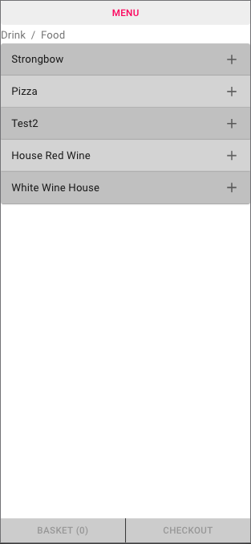
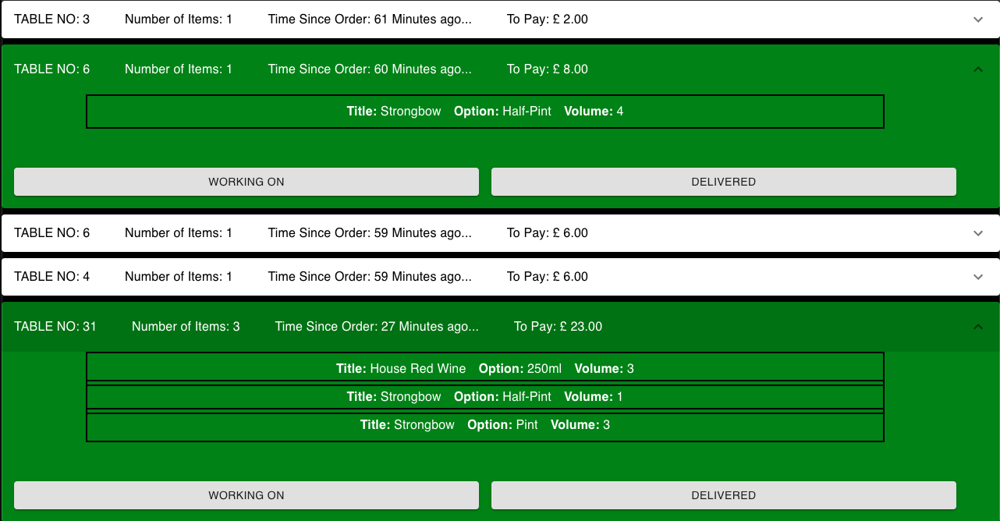
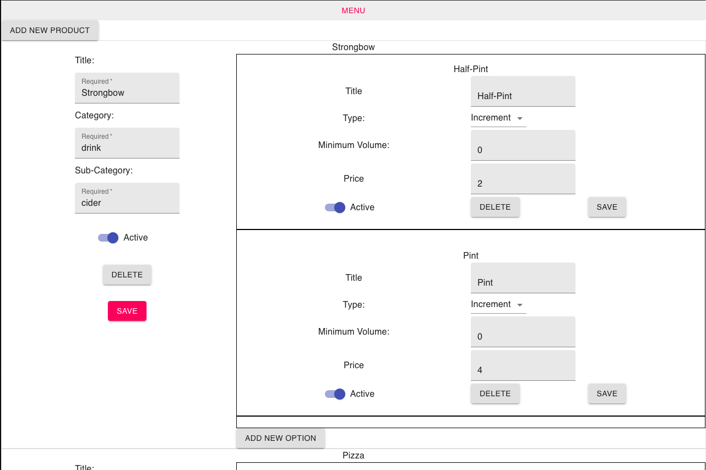

# The Bar App         

The Bar App is an open source application for bars, restaurants  and cafes for customers to order food and drinks in a covid-19 compliant way!

## Installation

I will provide a full installation guide once this is out of beta. 

## Usage

YouTube Demo: https://youtu.be/4BsfIE-5Hk0

**Customer View**

**Bar Staff View**

**Admin View**

## Contributing
Pull requests are welcome. For major changes, please open an issue first to discuss what you would like to change.

Please make sure to update tests as appropriate.

## License
[MIT](https://choosealicense.com/licenses/mit/)
